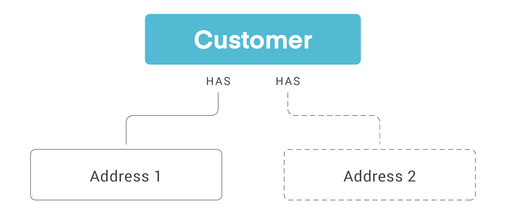

# Customers

|Scope|Description|
|-|-|
|`read_customer`| Required to read to the customer record.|
|`write_customer`| Required to write to the customer record.|
|`write_payments`| This scope is only needed when creating or updating customer payment token information.|

## What is a Customer?

ReCharge creates a Customer record when a customer checks out on an ecommerce storefront with a ReCharge subscription. 

The Customer object contains key information such as:

- The customer's ReCharge `id`
- Billing information
- The external id associated with the customer on an ecommerce platform

The Customer record changes when either a merchant [updates the Customer information](https://support.rechargepayments.com/hc/en-us/articles/360008682314-Updating-billing-information-for-a-customer) or when the customer themselves edit their information  in the [ReCharge Customer Portal](https://support.rechargepayments.com/hc/en-us/articles/360008683274-Customer-portal-).

You may need to interact with the Customer object when, for example, a customer adds a new payment method to their account on an external ecommerce store or changes their billing information.

<!-- theme: info -->
> Creating a customer within ReCharge will not create a customer record within an external ecommerce platform at this time.

## Customers and Addresses

The Addresses endpoint is a child of the Customer object. Customers can have many addresses associated with their account. Addresses cannot be associated with multiple customers. 



The address nested under a customer resource is the customer's billing address associated with their payment method. It is not the address associated with delivery of a subscription. For the subscription shipping address, see [Subscriptions](subscriptions.md)

## Customer payment method

Update the customer object to add or update a customer's payment method. ReCharge doesn't accept payment information directly. You should send a tokenized customer representation from the payment processor to add or update the payment method. When using Stripe as your payment processor, the [customer token](https://stripe.com/docs/api/customers/object#customer_object-sources-data-tokenization_method) should begin with the prefix `cus`, not `tok`.

## Use cases

<!--
type: tab
title: Update payment method
-->

`PUT` to `/customers/:id` endpoint

### Example request body

```json

{
    "stripe_customer_token": "cus_IV0hD7FtykKe1a"
}
```

<!--
type: tab
title: Update billing information
-->

`PUT` to `/customers/:id` endpoint

### Example request body

```json
{
    "first_name": "Mike",
    "last_name": "Flynn",
    "billing_address1": "3030 Nebraska Avenue",
    "billing_address2": null,
    "billing_zip": "90404",
    "billing_city": "Los Angeles",
    "billing_company": null,
    "billing_province": "California",
    "billing_country": "United States",
    "billing_phone": "3103843698",
}
```

<!-- type: tab-end -->

<!-- theme: warning -->
> ### Deprecated fields
>These fields are deprecated, however they will not be removed from this API version:
>
>|Deprecated field|Alternative|
>|-|-|
>|`product_title`|`title`|
>|`shipping_date`|`scheduled_at`|
>|`shopify_id`|`shopify_order_id`|
>|`address_is_active`|Ignore, field not applicable|

## Resources
[Customers reference](https://developer.rechargepayments.com/#customers)

