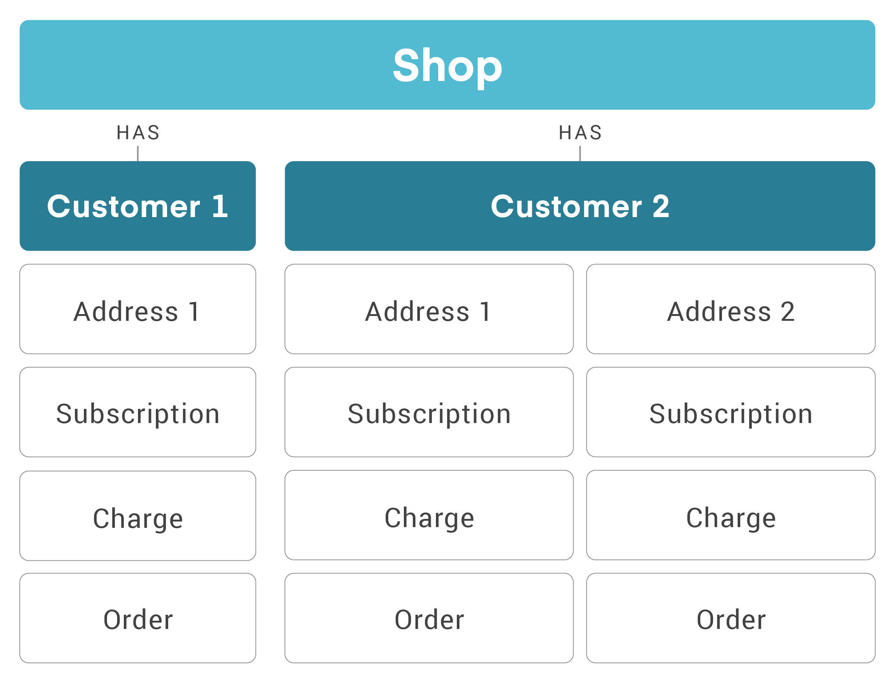

# Introduction
You will find reference information, customization guides and use-case examples for ReCharge's API in this space.

To see the full API schema for each endpoint, visit the [API Reference](https://developer.rechargepayments.com/).

## The ReCharge API
The Recharge API is organized around REST. Our API has predictable resource-oriented URLs, accepts JSON-encoded request bodies, returns JSON-encoded responses, and uses standard HTTP response codes, authentication, and verbs.

## Base URL
The base URL for ReCharge's rest API is `https://api.rechargeapps.com`

## Data structure
Subscriptions are tied to a given address. Each customer can have multiple address objects (many-to-one) in a relationship. 

