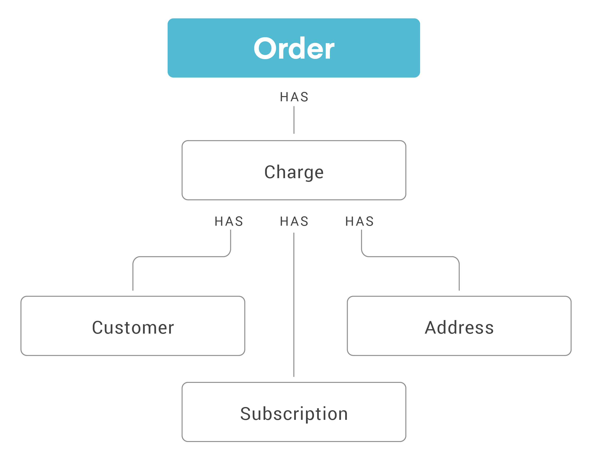

# Orders

|Scope|Description|
|-|-|
|`read_orders`| Required to read orders record.|
|`write_orders`| Required to write to the orders record.|

## What is an Order?
Orders contain information about the line items in an order, the corresponding ReCharge subscription ID for the order, and IDs for a corresponding order if one is created on an external ecommerce platform. 

In our direct integrations, an order is created in ReCharge after we've successfully processed a [Charge](https://developer.rechargepayments.com/#charges). When using our [API Integration](headless-overview.md), you should create an Order record in your external integration to maintain consistency between data in ReCharge and on your external platform. See our guide on [syncing orders via API integration](submitting-order-api.md) for more infromation.

The orders resource also contains some information about the customer. See [Addresses](https://developer.rechargepayments.com/#addresses) and [Customers](https://developer.rechargepayments.com/#customers) for detailed billing information.

At this time, you can only update orders that are [prepaid queued order](https://support.rechargepayments.com/hc/en-us/articles/360008682674-Converting-a-subscription-from-monthly-to-prepaid-). These items have been paid ahead of time by the customer but are set to be delivered on a recurring cycle. An order contains all the same JSON data as the charge. In case of a prepaid order creation, the order will be queued for a particular date and submitted on that date to the external ecommerce platform. 

## Updating line items
You can only update `line_item` properties directly on the Orders object if it is a prepaid subscription.  

To update an Order's `line_items`, you must update the corresponding [Subscription](https://developer.rechargepayments.com/#subscriptions), which will then generate a new [Charge](https://developer.rechargepayments.com/#charges). You must make changes to the Order `line_items` this way because the values of this property are inhereted from the Charge model.
<!-- theme: warning -->
> When updating `line_items` you must provide all the JSON data that was in `line_items` before the update, as the data you provide in a `PUT` overrides the previous record and only new data will remain.



## Use cases
<!--
type: tab
title: Update billing address on pre-paid order
-->
`PUT` to PUT /orders/:id

```json
{
"billing_address": {
  "city": "Los Angeles",
  "first_name": "mike",
  "last_name": "flynn",
  "zip": "90025"
 }
}
```

<!--
type: tab
title: Update order date
-->
`POST` to `/orders/:id/change_date`

```json
{
    "scheduled_at": "2018-07-01T00:00:00"
    }
```

<!-- type: tab-end -->

<!-- theme: warning -->
> ### Deprecated fields
>These fields are deprecated, however they will not be removed from this API version:
>
>|Deprecated field|Alternative|
>|-|-|
>|`product_title`|`title`|
>|`shipping_date`|`scheduled_at`|
>|`shopify_id`|`shopify_order_id`|
>|`address_is_active`|Ignore, field not applicable|

## Resources
[Orders reference](https://developer.rechargepayments.com/#orders)